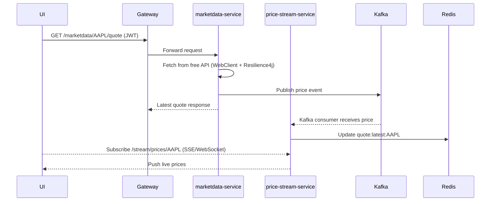
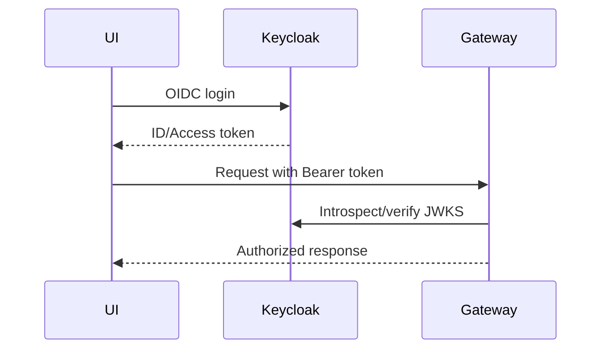
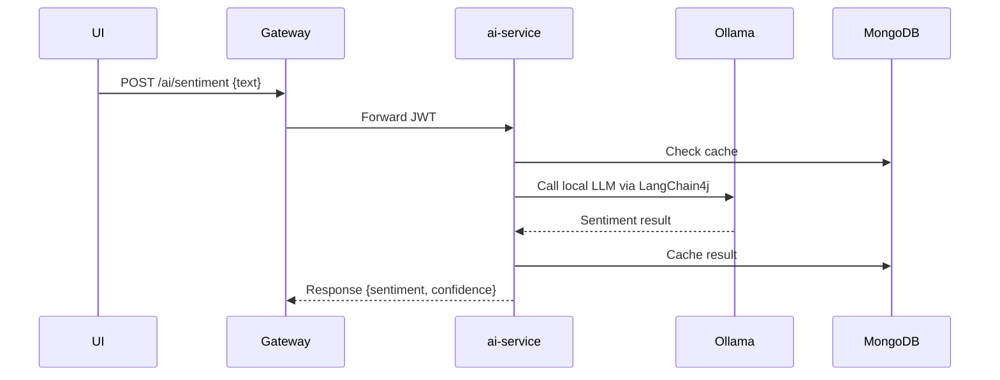
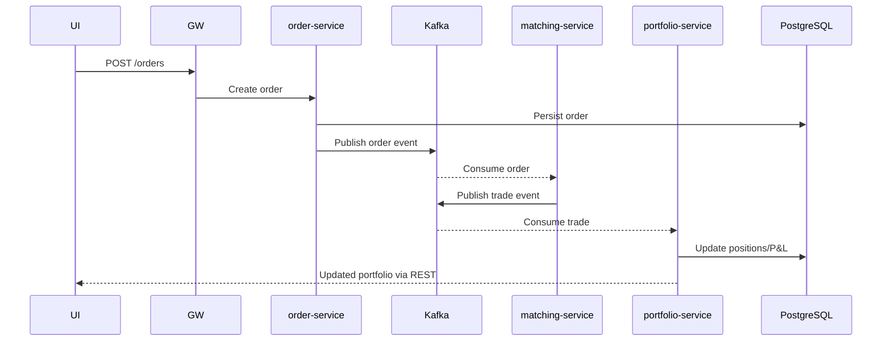

# Stock Metrics

Stock Metrics is an open-source, AI-augmented, cloud-ready stock-market analysis platform built with Spring Boot microservices, Kafka event streaming, PostgreSQL, MongoDB, Redis, Keycloak security, and a modern React frontend. It targets free/open-source tooling and Oracle Cloud Free Tier deployability.

## System Overview
- **Gateway:** Spring Cloud Gateway with OAuth2/OIDC enforcement, rate limiting, request/response logging, and Micrometer metrics.
- **Auth:** Keycloak realm for RBAC and JWT issuance; auth-service wraps Keycloak admin APIs for profile metadata.
- **Services:** Market data ingestion, price streaming, order management, matching, portfolio, ratios/analytics, AI insights, notifications, admin/settings.
- **Data Stores:** PostgreSQL (transactions), MongoDB (historical/AI cache), Redis (quotes/cache), Kafka (events), S3-compatible/minio (artifacts/backtests optional).
- **Observability:** Prometheus + Grafana, Jaeger tracing, ELK/OpenSearch logging.
- **AI:** Ollama local models + LangChain4j orchestration + HuggingFace/DJL sentiment/forecasting; cached in MongoDB.
- **Frontend:** React + Redux Toolkit + Bootstrap + Chart.js, WebSocket/SSE for streaming, Keycloak JS adapter for login.

## High-Level Architecture (Mermaid)
```mermaid
flowchart LR
    subgraph Security
        KC[Keycloak]
    end
    subgraph Gateway
        GW[Spring Cloud Gateway]
    end
    subgraph Core
        MD[marketdata-service]
        PS[price-stream-service]
        OR[order-service]
        MT[matching-service]
        PF[portfolio-service]
        RT[ratios-service]
        AI[ai-service]
        NT[notification-service]
        AD[admin-service]
    end
    subgraph Data
        PG[(PostgreSQL)]
        MG[(MongoDB)]
        RD[(Redis)]
        KFK[((Kafka))]
    end
    FE[React UI]

    FE -- OIDC --> KC
    FE -- HTTPS --> GW
    GW --> MD
    GW --> PS
    GW --> OR
    GW --> PF
    GW --> RT
    GW --> AI
    GW --> NT
    GW --> AD

    MD --> MG
    MD --prices--> KFK
    PS --consume prices--> KFK
    PS --> RD
    PS --SSE/WebSocket--> FE

    OR --> PG
    OR --orders--> KFK
    MT --consume orders--> KFK
    MT --trades--> KFK
    PF --consume trades--> KFK
    PF --> PG

    RT --> MG
    RT --> PG

    AI --ai.requests--> KFK
    AI --cache--> MG
    NT --alerts--> KFK
    NT --> PG

    GW -. tracing .- Jaeger
    GW -. metrics .- Prometheus
```

## Sequence Diagrams
**Price Fetch + Stream**


**User Login**


**AI Sentiment**


**Simulated Order Flow**


## Microservices Summary
| Service | Responsibilities | Data Stores | Kafka Topics |
|---------|------------------|-------------|--------------|
| **gateway** | Routing, OAuth2, rate limiting, tracing headers | n/a | n/a |
| **auth-service** | Keycloak admin facade, user profile | PostgreSQL | n/a |
| **marketdata-service** | Poll free APIs, canonicalize quotes, store history, publish prices | MongoDB | `prices.*` |
| **price-stream-service** | Consume Kafka, cache latest in Redis, expose SSE/WebSocket | Redis | `prices.*` |
| **order-service** | Validate orders, persist, publish events | PostgreSQL | `orders` |
| **matching-service** | Simulated matching, publish trades | In-memory/Kafka Streams | `orders`, `trades` |
| **portfolio-service** | Holdings, P&L, settlement | PostgreSQL | `trades` |
| **ratios-service** | Financial ratios & analytics | PostgreSQL/MongoDB | `analytics` (optional) |
| **ai-service** | Ollama + LangChain4j for sentiment/predictions | MongoDB | `ai.requests`, `ai.responses` |
| **notification-service** | Alerts, email/push simulation | PostgreSQL/Redis | `alerts` |
| **admin-service** | Symbols, API keys, settings | PostgreSQL | n/a |

## Data Models (Key Tables)
- **PostgreSQL**
  - `users(id, email, keycloak_id, roles, created_at)`
  - `orders(id, user_id, symbol, side, type, price, quantity, status, created_at)`
  - `trades(id, buy_order_id, sell_order_id, symbol, price, qty, ts)`
  - `positions(user_id, symbol, qty, avg_price, realised_pl)`
  - `alerts(id, user_id, symbol, condition, status, created_at)`
- **MongoDB**
  - `historical_quotes{symbol, timestamp, open, high, low, close, volume, interval}`
  - `news{symbol, title, text, published_at, sentiment_score}`
  - `ai_cache{symbol, timeframe, model, prediction, generated_at}`
- **Redis Keys**
  - `quote:latest:{symbol}`
  - `user:session:{userId}`

## Kafka Topics & Payloads
- `prices.{symbol}`: `{symbol, ts, bid, ask, last, volume}`
- `orders`: `{orderId, userId, symbol, side, qty, price, type, ts}`
- `trades`: `{tradeId, buyOrderId, sellOrderId, symbol, qty, price, ts}`
- `alerts`: `{userId, symbol, condition, state, ts}`
- `ai.requests` / `ai.responses`: request/response messages for async AI tasks

## Milestones
1. **MVP (2–3 wks):** Gateway, Keycloak, user service, marketdata-service polling free API, price-stream-service SSE, React UI (login + watchlist + live chart). Docker Compose runnable.
2. **Event-driven Trading (3–4 wks):** Kafka, order/matching/portfolio services, Redis cache, basic AI sentiment. Simulated trades visible in UI.
3. **Observability + CI/CD (2–3 wks):** Prometheus, Grafana, Jaeger, GitHub Actions CI, deploy to Minikube. Metrics + tracing dashboards.
4. **Advanced AI + Backtesting (2–4 wks):** AI predictions, backtesting module, Postman collection, full docs.

## Getting Started
- **Market Data Service:** `cd microservices/marketdata-service && ./mvnw test && ./mvnw spring-boot:run`
- **Frontend:** `cd frontend && npm install && npm start`
- **Docker Compose (coming soon):** will orchestrate Kafka, MongoDB, Redis, Keycloak, services.

## Repo Layout
```
README.md                    # this overview
microservices/marketdata-service  # starter Spring Boot service
frontend/                    # React skeleton
infrastructure/              # k8s manifests, CI/CD, diagrams (to be expanded)
docs/openapi/                # OpenAPI specs per service
```

## Oracle Cloud Free Tier Deployment (Summary)
1. Provision **Always Free** ARM Compute + Autonomous Postgres (or self-hosted Postgres on compute), VM for Kafka/Redis/MongoDB.
2. Install **K3s** or **OKE Free**; apply manifests under `infrastructure/k8s` (future expansion) with `kubectl apply -f`.
3. Use **Oracle Container Registry** or **GHCR** for images; push from CI.
4. Expose Gateway via **LoadBalancer** or **Ingress**; secure with TLS (Let's Encrypt via cert-manager or self-signed for dev).

## Documentation & Next Steps
- Detailed per-service READMEs will live in `microservices/*/README.md`.
- OpenAPI specs in `docs/openapi` for quick client generation.
- CI/CD workflows and K8s manifests will be added iteratively.
